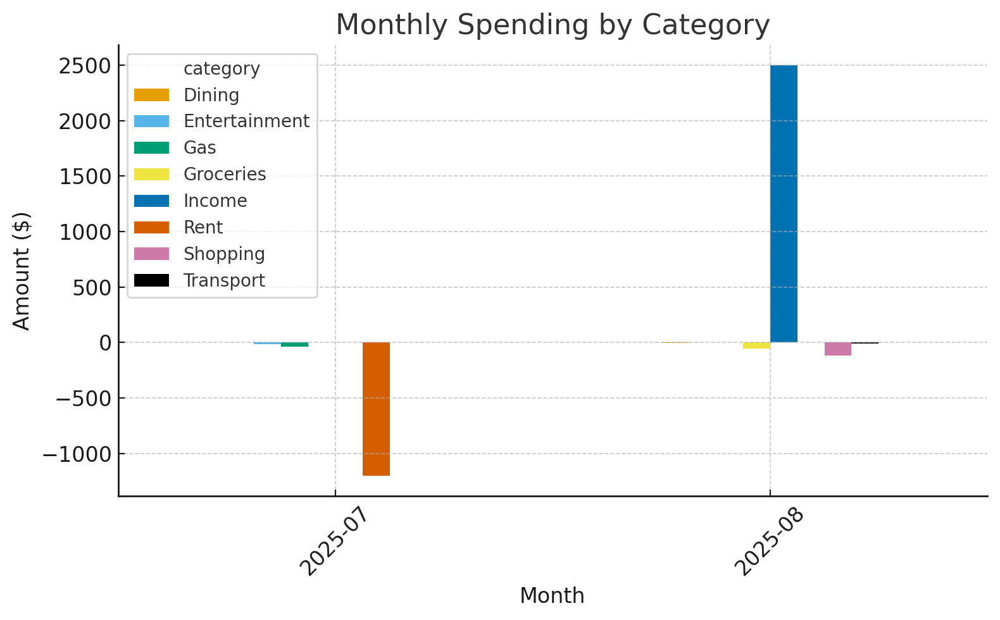
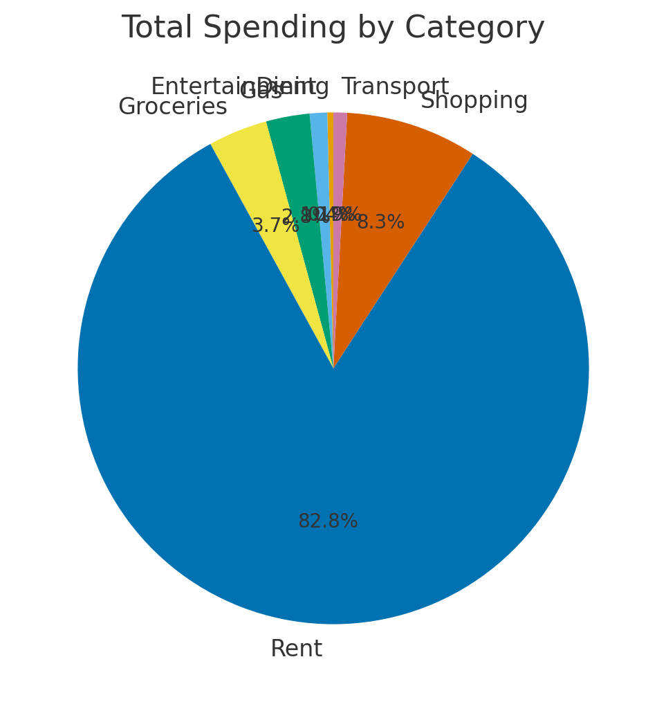

# Bank Transaction Analyzer

##What It Does
This is a Java commandline program that analyzes bank transactions from a CSV file.  
It reads, categorizes, and summarizes your transactions to help visualize spending patterns.

**Features:**
- Reads a CSV of transactions (date, description, amount)
- Categorizes transactions using keyword rules (ex, "Uber" = Transport)
- Prints a spending summary by category
- Generates a `category_month_report.csv` file (month, category, total)
- Optional Python script to create charts for README/demo

---

## Tech Stack
- Java
- JUnit 5
- Python + pandas + matplotlib (for generating charts)

---

## How to Run

### Compile and run
```bash
javac src/BankTransactionAnalyzer.java
java -cp src BankTransactionAnalyzer sample_data/transactions.csv

---

## Example Output
Based on my made up sample data:
Monthly:

Summary

